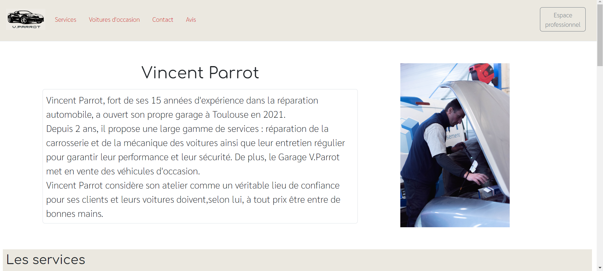

Projet Vincent Parrot
==============



Ce site web mobile de Vincent Parrot est fait pour lui permet une meilleur visibilitée sur le net en proposant ses différents services et voitures d'occasion, ainsi qu'une utilisation au sein de son garage sur tout les supports disponible. 

Ce dépôt comprend :
* Le code en PHP 8
* Une base de données mariaDB 
* Du JavaScript
* Du HTML5 et CSS3


Pré-requis
----------

* Une base de données MySQL ou mariaDB
* Un serveur web apache2
* PHP > = V8


Installation
------------

Synchroniser le code php dans le répertoire root de apache
   ```
   $ git@github.com:Estelle-Berger/Vincent-Parrot.git
   ```
   
Importer la base de données
  ```
   $ mysql -u $user -p $database_name < import.sql
```
Changelog
=========

## [1.0.0] - 2024-03-13

- Version initiale
                     

Copyright 
====================


Copyright © 2024 Estelle BERGER – esteleberger13@gmail.com